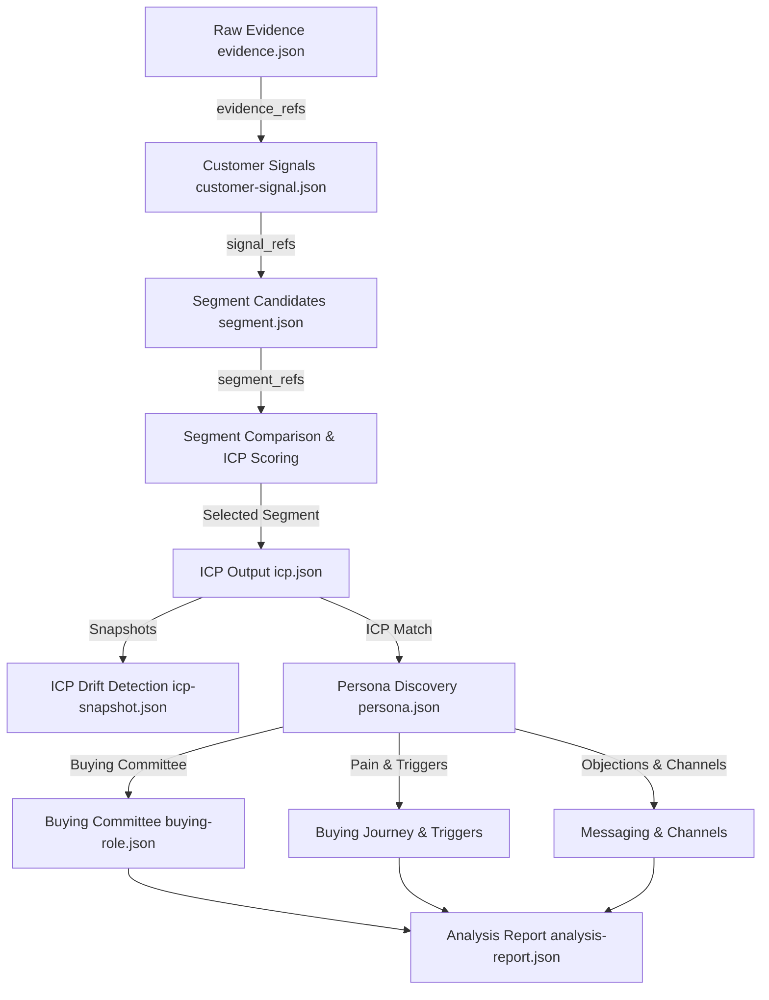

# Architecture Specification

## Traceability Path
Every node in the graph relies on a valid parent reference ID. If any link in the chain breaks, the downstream quality gate fails and sets status to `"unknown"`.
- `EV-xxx` -> Raw Evidence
- `SIG-xxx` -> Extracted Customer Signal
- `SEG-xxx` -> Segment Candidates
- `ICP-xxx` -> Target Ideal Customer Profile
- `PER-xxx` -> Discovered Personas
